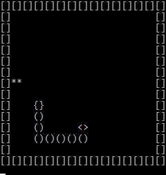

# Snake  
Basic snake game in console.
## How it works
game area is saved in multidimensional array, 
which is changed every X ms.

After initialization, game works in loop with a few steps:
1. Show array to user.
2. Get snake location.
3. Check area around snake's head.
4. Get user input.
5. If path is valid, change array according to user input, if its not, game is over.
## Screenshots
  
`**` candy  
`<>` snake's head  
`()` snake's body  
`{}` snake's tail  
`[]` wall